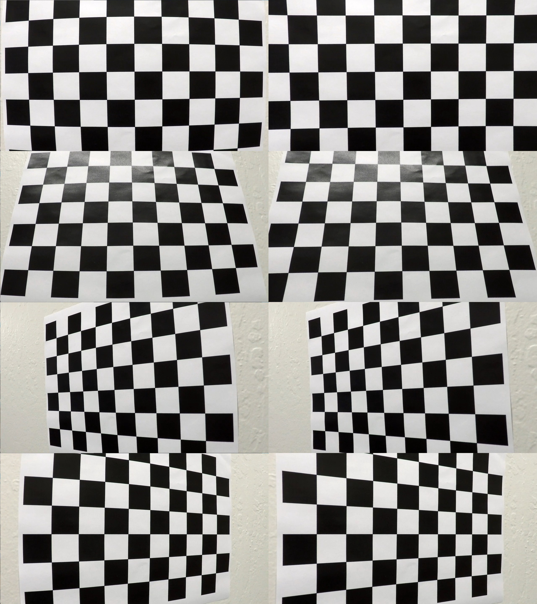
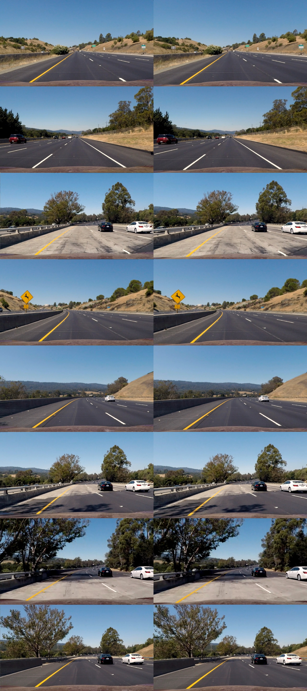
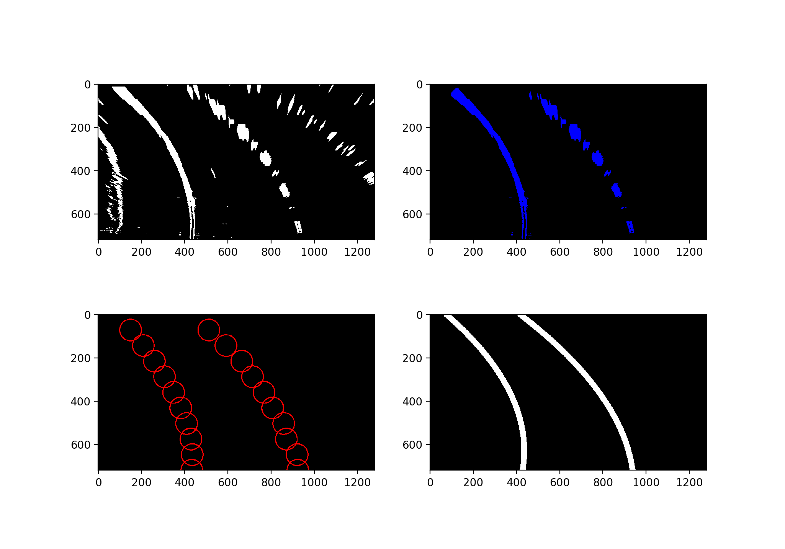
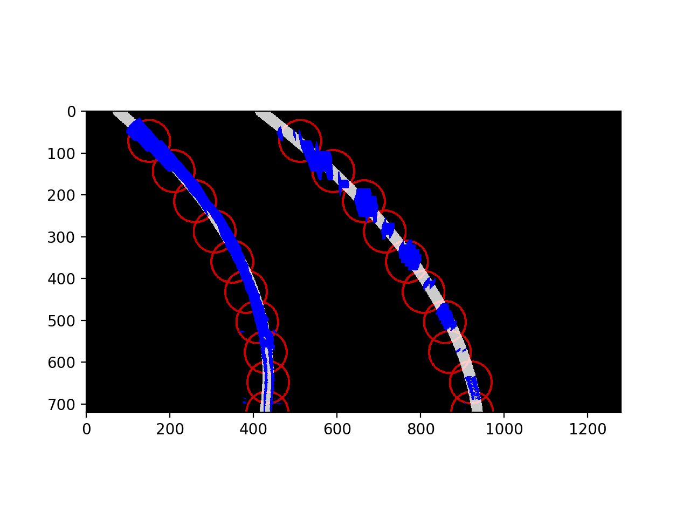
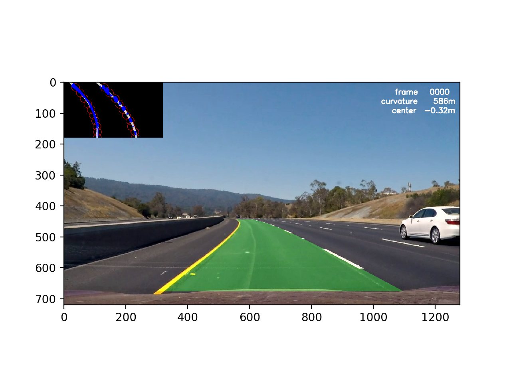

# **Advanced Lane Finding Project**
---

The goals / steps of this project are the following:

* Compute the camera calibration matrix and distortion coefficients given a set of chessboard images.
* Apply a distortion correction to raw images.
* Use color transforms, gradients, etc., to create a thresholded binary image.
* Apply a perspective transform to rectify binary image ("birds-eye view").
* Detect lane pixels and fit to find the lane boundary.
* Determine the curvature of the lane and vehicle position with respect to center.
* Warp the detected lane boundaries back onto the original image.
* Output visual display of the lane boundaries and numerical estimation of lane curvature and vehicle position.

The above evaluated based on the project's [Rubric Points](https://review.udacity.com/#!/rubrics/571/view)

---
### Writeup / README

#### 1. Provide a Writeup / README that includes all the rubric points and how you addressed each one.

- [x] This is it.

---
### Camera Calibration

#### 1. Briefly state how you computed the camera matrix and distortion coefficients. Provide an example of a distortion corrected calibration image.

- [x] The code for this step is contained in the file [calibration.py](https://github.com/cwelton/advance_lane_lines/blob/master/calibration.py)

1. Calibration

    * Create a grid of 3 dimensional cordinates of the chessboard corners space
    * Loop through all the calibration images
    * Convert to grayscale
    * If the image shape is not expected, resize (there are a couple calibration images with an extra ixel)
    * Find the chessboard corners using the opencv `findChessboardCorners` function
    * If corners were found add the points into the set of image and object points arrays
    * Once all images are processed complete the calibration using the opencv calibrateCamera function

    Since calibration can take some time and I didn't want to wait for it while testing and running
    repeated trials the `calibrate` function also pickles and saves the result and will use that
    pickled result on future calls.

    [Code here](https://github.com/cwelton/advance_lane_lines/blob/master/calibration.py#L22-L53)

2. Undistorting

    * Using the calibration matrix calculated above undistortion can be completed

    [Code here](https://github.com/cwelton/advance_lane_lines/blob/master/calibration.py#L55-L69)

3. Running the script

    Running the script will read the calibration images, create a calibration matrix, load all the files in the calibration    directory, and produce and output file in the output directory demonstrating the effects of calibration.

    The rest of the code will `import calibration` and call `calibration` and `undistort` directly.

    Here is the example output file from the calibration, with the left side images being the original and the right side being undistorted versions.  From this output you can clearly see lines have become straighter on the example output images.

    

---
### Pipeline (single images)

#### 1. Provide an example of a distortion-corrected image.

- [x] Distortion corrected images are produced by running the `calibrate.py` script described above.

    The following are examples of distortion corrected images.  The original's are on the left, the undistorted versions are on the right.

    I do observe that some of the cars at the edge of the screen look more distorted after the distortion correction, but overall lines are straighter, which is the goal of the distortion correction.
    
    

#### 2. Describe how (and identify where in your code) you used color transforms, gradients or other methods to create a thresholded binary image.  Provide an example of a binary image result.

- [x] Color transforms can be found within the `perspective.py` script, with additional helper functions in `helpers.py`.

    Initial experimentation to aid in selecting threshold values were run via the [threshold_tuning.py](https://github.com/cwelton/advance_lane_lines/blob/master/threshold_tuning.py) script, which enables an interactive adjustment of tuning paremeters.
    
    I used the following transformations and methods on the data
    
    1.  Color Transformation
    
        The input images are converted into the HSL colorspace where I then extract the L and S
        channels for gradient transformations and color thresholds.
        
    2.  Gradient Transformations
    
        I used a Sobel transform to detect gradient changes within the image along the X axis
        
    3.  Image Normalization
    
        I normalized the image to better account for scaling differences between images
        
    4.  Color Thresholds
    
        I applied a color threshold on the S channel to better identify lane lines
        
    The code for the above can be found in [perspective.py](https://github.com/cwelton/advance_lane_lines/blob/master/perspective.py#L57-L88)
        
    Example images shown in combination with the perspective transform at the end of the section below.

#### 3. Describe how (and identify where in your code) you performed a perspective transform and provide an example of a transformed image.

- [x] Perspective transforms can be found within the `perspective.py` script

    The perspective transformation is achieved with the opencv functions `getPerspectiveTransform` and `warpPerspective`.  The principal challenge is identifying the source and destination points to build the transformation matrix.
    
    To build the source and destination points were calibrated based identifying distinct points on images with a straight row and mapping them into a perspective rectangle.  The initial rectangle selected was the same width as the base of the perspective quadrilateral, but I found that curved lanes would then exit the plane of the transform, so I adjusted the target space to a narrower width to capture more line information.  This also had the effect of bringing in more adjacent noise which must be handled while identifying the lane lines.

    I verified that my perspective transform was working as expected by drawing the `src` and `dst` points onto a test image and its warped counterpart to verify that the lines appear parallel in the warped image.

    The following is output of the color transformation and perspective transforms applied to test images with guide lines indicating the location of the perspective transformation.
    
    

#### 4. Describe how (and identify where in your code) you identified lane-line pixels and fit their positions with a polynomial?

- [x] Fitting lane pixels to polynomials via opencv `fitpoly`

    I expermemented with a couple ways of doing this which can be found in `windows_1.py`, `windows_2.py`, `windows_3.py` and as I started to get into handling usage of historical image frames there is also some code in `video.py`.  For the purposes of this section I will focus on the work in `windows_3.py` as this is the most concise to describe the process for a single image based on my final work.  The earlier `windows_1` and `windows_2` were prototypes and not used in the final solution.
    
    1. Apply the distortion correction, threshold detection, and perspective warping outlined in the prior steps.
    2. Identify centroids of pixels [based on convolutions](https://github.com/cwelton/advance_lane_lines/blob/master/windows_3.py#L130-L184)
    3. Create an image mask [based on the centroids](https://github.com/cwelton/advance_lane_lines/blob/master/windows_3.py#L204-L207)
    4. Mask the warped to keep only [the points near the centroids](https://github.com/cwelton/advance_lane_lines/blob/master/windows_3.py#L209-L210)
    5. Use the numpy `polyfit` method to create a 2nd order [polynomial fit based on the observed data.](https://github.com/cwelton/advance_lane_lines/blob/master/windows_3.py#L186-L190)
    6. Convert the polynomial [back into points in imagespace.](https://github.com/cwelton/advance_lane_lines/blob/master/windows_3.py#L238-L240)
    7. Use opencv `polylines` and `fillPoly` functions to [draw the fit back into the image.](https://github.com/cwelton/advance_lane_lines/blob/master/windows_3.py#L242-L253)
        
    Here are two images that show the individual steps in the pipeline and the combined result
    
    
    
    

#### 5. Describe how (and identify where in your code) you calculated the radius of curvature of the lane and the position of the vehicle with respect to center.

- [x] Calculation of curvature and lane position in `curvature.py`

    Radius of curvature is calculate by:
    
    1. Converting the lane points from pixel space to real space
    2. Applying the formula `(1+(2Ay+B)^2)^1.5)/|2A|` to calculate curvature
    3. Comparing the midpoint of the detected lines to the midpoint of the screen.
    
    [Code](https://github.com/cwelton/advance_lane_lines/blob/master/curvature.py)
    

#### 6. Provide an example image of your result plotted back down onto the road such that the lane area is identified clearly.

- [x] Plotting lane indication is done in the main `process_image` method

    [Code](https://github.com/cwelton/advance_lane_lines/blob/master/windows_3.py#L230-L316)

    

---

### Pipeline (video)

#### 1. Provide a link to your final video output.  Your pipeline should perform reasonably well on the entire project video (wobbly lines are ok but no catastrophic failures that would cause the car to drive off the road!).

- [x] [download video result](output.mp4)

---

### Discussion

#### 1. Briefly discuss any problems / issues you faced in your implementation of this project.  Where will your pipeline likely fail?  What could you do to make it more robust?

- [x] There are a couple things I would have liked to have gotten too, including:

    * Identifying additional preprocessing to better detect lines on the lighter sections of road
    * Improving incremental line search
    * Increased use of evidence from historical frames

    Where the primary issue with implementing the above was juggling time pressure between this
    project and other deadlines.

